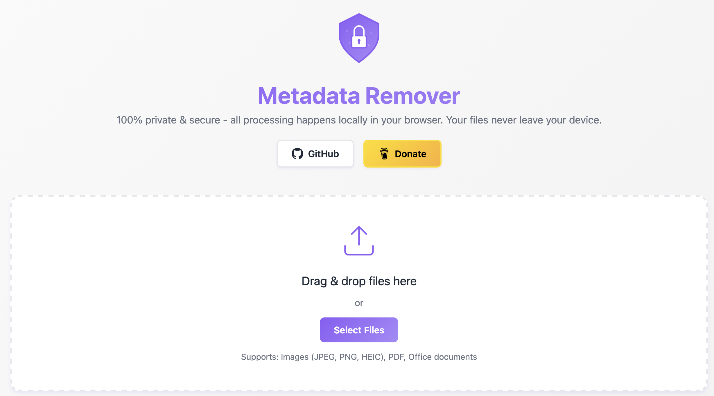
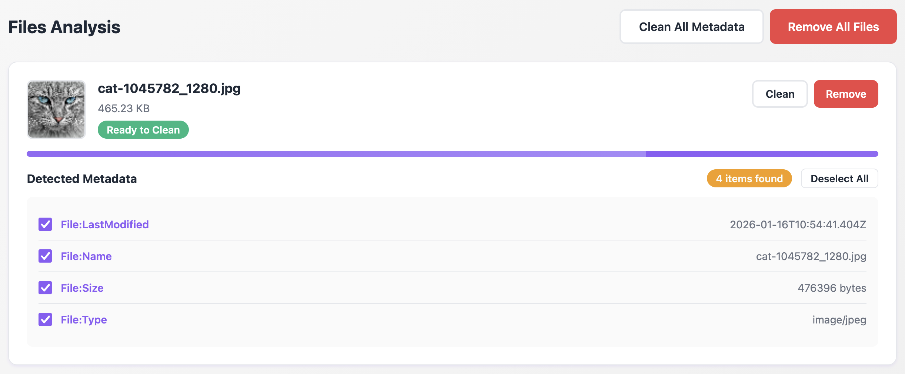

# 🔒 Metadata Remover

A secure, privacy-focused web application for removing metadata from files. All processing happens client-side in your browser - no files are uploaded to any server.

## Screenshots

### Landing Page


### Metadata Analysis & Cleaning


## Features

- **100% Client-Side Processing** - Files never leave your browser
- **Beautiful Animated UI** - Smooth animations and progress indicators
- **Comprehensive Metadata Detection**:
  - EXIF data from images (camera info, GPS, timestamps)
  - PDF metadata (author, creator, dates)
  - macOS extended attributes (Where From tags, download info)
  - File system metadata
- **Preview Before Removal** - See all metadata before cleaning
- **Selective or Bulk Removal** - Clean individual files or all at once
- **Secure by Design** - No server storage, no tracking
- **Docker Ready** - Easy deployment with Docker

## Supported File Types

- Images: JPEG, PNG, HEIC
- Documents: PDF, DOCX, XLSX, PPTX

## Quick Start

### Using Docker

```bash
# Build and run
docker-compose up -d

# Or build manually
docker build -t metadata-remover .
docker run -p 8080:80 metadata-remover
```

Visit `http://localhost:8080`

### Local Development

Simply open `index.html` in a modern web browser. No build step required!

## How It Works

1. **Upload** - Drag & drop or select files
2. **Analyze** - App scans for metadata (EXIF, PDF info, macOS tags, etc.)
3. **Preview** - Review all detected metadata
4. **Clean** - Remove metadata with one click
5. **Download** - Get your cleaned files

## Security & Privacy

- All processing happens in your browser using JavaScript
- No files are sent to any server
- No data collection or tracking
- Open source - verify the code yourself

## Technical Details

- Pure HTML/CSS/JavaScript - no frameworks
- Uses Canvas API for image metadata removal
- EXIF.js for comprehensive EXIF data extraction
- Nginx for production serving
- Docker for easy deployment

## Browser Support

Works in all modern browsers:
- Chrome/Edge 90+
- Firefox 88+
- Safari 14+

## License

MIT License - feel free to use and modify
